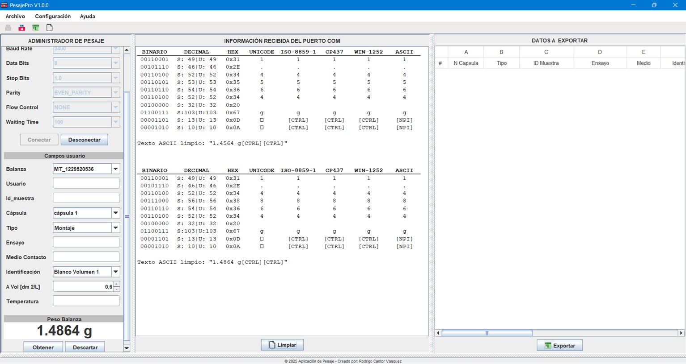

# PesajePro - Sistema de Captura y Gestión de Datos de Balanzas RS-232 


---

# 📖 Descripción

**PesajePro** es una aplicación de escritorio desarrollada en **Java (Swing + JavaFX)** que permite recibir, visualizar y registrar en tiempo real los datos de peso enviados por balanzas y equipos industriales que se comunican bajo el protocolo **RS-232** a través de puerto serie COM.

El sistema detecta y extrae automáticamente el valor de peso dentro de la trama cruda recibida —probando en paralelo varias codificaciones (decimal, hexadecimal, ASCII, ISO-8859-1, CP437 y Windows-1252)— mediante un formato configurable por expresiones regulares, lo que permite adaptarlo a distintos protocolos de trama según la marca o modelo de balanza conectada (actualmente configurado por defecto para una balanza Mettler Toledo). Cada registro puede completarse con datos de la muestra (cápsula, tipo, ensayo, medio de contacto, volumen, temperatura, etc.), editarse desde una tabla interactiva y exportarse a Excel, con respaldo incremental automático para evitar pérdida de datos ante cierres inesperados de la aplicación.

---

# 🖼️ Vista previa



---

# ✨ Características principales

- 🔌 Conexión configurable a balanzas por puerto serie COM (baud rate, bits de datos, paridad, bits de parada, control de flujo) mediante **jSerialComm**.
- 📡 Lectura en tiempo real del flujo de datos en un hilo dedicado, sin bloquear la interfaz.
- 🔍 Panel de diagnóstico de trama cruda con seis vistas de codificación simultáneas (decimal, hexadecimal, ASCII, ISO-8859-1, CP437, Windows-1252).
- 🎯 Extracción automática del peso mediante expresiones regulares configurables según el formato de trama de cada balanza.
- ⚖️ Configuración de unidad de medida y número de decimales (mg / g / kg).
- 📝 Registro de datos de muestra (cápsula, tipo, ID de muestra, ensayo, medio de contacto, identificación, volumen/área, temperatura, fecha, hora, usuario).
- 📊 Tabla de registros interactiva, con botones de **Actualizar** y **Eliminar** embebidos en cada fila (`TablaPersonalizada`).
- 💾 Respaldo incremental automático en Excel (`datos_incrementales.xlsx`), recuperable si la aplicación se cierra de forma inesperada.
- 📤 Exportación final a Excel mediante **Apache POI**, con lectura/escritura dinámica de columnas.
- 🧩 Ejecución opcional de macros de Excel vía automatización COM (**jacob**) sobre el archivo exportado.
- ⚙️ Configuración persistente en JSON mediante **Gson**.
- 🚫 Bloqueo de instancias múltiples mediante un socket local en el puerto `54321`.
- 🎨 Layout de interfaz personalizado (`MyCustomLayout`), construido desde cero para el panel de encabezado.

---

# 📂 Estructura del proyecto

```
04_recibir_datos_balanza_metter_toledo/
│
├── src/
│   ├── principal/                    # Núcleo de la aplicación
│   │   ├── Principal.java              # Punto de entrada, instancia única (puerto 54321)
│   │   ├── ConectarsePuertoCOM.java     # Conexión y lectura del puerto serie (jSerialComm)
│   │   ├── Excel.java                   # Utilidades generales de manejo de Excel
│   │   ├── DynamicExcelReader.java      # Lectura dinámica de columnas (Apache POI)
│   │   ├── DynamicExcelWriter.java      # Escritura/edición dinámica de columnas (Apache POI)
│   │   ├── Fecha.java                   # Utilidades de fecha/hora
│   │   ├── RutaGuardada.java            # Persistencia de la última ruta de exportación
│   │   └── Balanzas.java                # Enum de balanzas soportadas (nº de serie)
│   │
│   ├── vistasFrame/                  # Ventanas secundarias (JFrame)
│   │   ├── FrameEstablecerConexion.java
│   │   ├── FrameSistemaMedicion.java
│   │   ├── FrameDatosPredeterminados.java
│   │   ├── FrameActualizarDatosRegistro.java
│   │   ├── FrameSobreMi.java             # "Sobre mí", con JavaFX embebido (JFXPanel)
│   │   ├── FrameVistasPaneles.java
│   │   └── FrameDatosRecibidos.java
│   │
│   ├── vistasPanel/                  # Paneles principales (JPanel)
│   │   ├── PanelPrincipal.java           # Controlador central de la app (~1.900 líneas)
│   │   ├── PanelEncabezadoSuperior.java / PanelEncabezadoInferior.java
│   │   ├── PanelEncabezado.java / PanelPieDePaginaPrincipal.java
│   │   ├── PanelContenidoPrincipal.java
│   │   ├── PCP_DatosBalanza.java         # Formulario de datos de muestra
│   │   ├── PCP_TextoBalanza.java         # Panel de datos crudos recibidos
│   │   ├── PCP_ExportarDatos.java        # Tabla de registros + exportación
│   │   └── PCP_ResumenExportados.java
│   │
│   ├── renderizarBotonJTable/        # Botones embebidos en la JTable
│   │   ├── TablaPersonalizada.java
│   │   ├── BotonActualizarRenderer.java / BotonActualizarEditor.java
│   │   └── BotonEliminarRenderer.java / BotonEliminarEditor.java
│   │
│   ├── layoutPersonalizado/
│   │   └── MyCustomLayout.java           # LayoutManager propio (flow con salto de línea)
│   │
│   ├── recursos/                      # Íconos e imágenes (PNG/ICO)
│   └── lib/                           # Librerías externas
│       ├── jSerialComm-2.11.0/
│       ├── Complemento Java apache-poi-src-5.4.1-2025/
│       ├── openjfx-11.0.2_windows-x64_bin-sdk/
│       ├── jacob-1.21/
│       ├── Complemento pureJavaComm-1.0.4/       # (sin uso real, ver "Mejoras futuras")
│       └── complemento gson-2.12.1.jar/
│
├── archivosComplementarios/
│   └── configuracion.json             # Configuración persistente (Gson)
│
└── bin/                               # Clases compiladas (salida de Eclipse)
```

---

# 💻 Tecnologías utilizadas

## Interfaz gráfica
- **Java Swing** — interfaz principal de la aplicación.
- **JavaFX 11.0.2** — panel "Sobre mí" (`JFXPanel` embebido) y selector nativo de carpetas (`DirectoryChooser`).
- `MyCustomLayout` — `LayoutManager` propio, construido para el panel de encabezado.

## Comunicación y datos
- `jSerialComm 2.11.0` — comunicación real por puerto serie COM con la balanza.
- **Apache POI 5.4.1** (`poi`, `poi-ooxml`, `poi-ooxml-lite`, `xmlbeans`, `commons-collections4`, `commons-io`, `commons-compress`, `log4j-api/core`, `curvesapi`) — lectura, escritura y edición dinámica de archivos Excel.
- `jacob 1.21` — puente Java–COM para automatizar Excel (ejecución de macros) vía ActiveX. Requiere Windows + Microsoft Excel instalado.
- `gson 2.12.1` — serialización/deserialización de la configuración en `configuracion.json`.

## Arquitectura
- Proyecto Eclipse puro (sin Maven/Gradle), organizado en 5 paquetes: `principal`, `vistasFrame`, `vistasPanel`, `renderizarBotonJTable` y `layoutPersonalizado`.
- `PanelPrincipal.java` actúa como controlador central: conecta los eventos de la UI, gestiona la conexión serial, el parseo de la trama y la persistencia de los datos.

---

# ⚙️ Funcionalidades del sistema

- ✔ Detección y selección de puertos COM disponibles.
- ✔ Configuración de parámetros seriales (baud rate, bits de datos, paridad, bits de parada, control de flujo).
- ✔ Lectura en tiempo real del flujo de datos, con visualización en múltiples codificaciones para depurar el protocolo de cada balanza.
- ✔ Extracción automática del peso mediante expresiones regulares configurables.
- ✔ Configuración de unidad de medida y número de decimales.
- ✔ Registro, edición y eliminación de datos de muestra desde una tabla interactiva.
- ✔ Respaldo incremental automático en Excel, recuperable al reiniciar la aplicación.
- ✔ Exportación final de todos los registros a Excel.
- ✔ Ejecución opcional de macros de Excel sobre el archivo exportado.
- ✔ Persistencia de configuración (puerto, formato, datos predeterminados) entre sesiones.
- ✔ Bloqueo de múltiples instancias de la aplicación ejecutándose a la vez.

---

# ⚙️ Requisitos

- Java JDK 11 o superior.
- Sistema operativo Windows (requerido por la integración COM/ActiveX de `jacob` y por el flujo de empaquetado documentado con Launch4j / Inno Setup).
- Microsoft Excel instalado (opcional — solo necesario para la función de ejecución de macros tras la exportación).
- Balanza o equipo industrial con salida RS-232 por puerto COM.

---

# 🚀 Instalación y ejecución

### 1. Importar librerías en Eclipse
1. Importa el proyecto en Eclipse.
2. Clic derecho sobre el proyecto → `Properties`.
3. `Java Build Path` → pestaña `Libraries`.
4. Selecciona `Modulepath` → `Add External JARs`.
5. Agrega los `.jar` de cada subcarpeta dentro de `src/lib`.

### 2. Ejecutar en Eclipse
1. Ve a `Run > Run Configurations`.
2. En `Arguments` → `VM arguments`, agrega:

```text
--module-path "src\lib\openjfx-11.0.2_windows-x64_bin-sdk\javafx-sdk-11.0.2\lib"
--add-modules javafx.base,javafx.controls,javafx.fxml,javafx.graphics,javafx.media,javafx.swing,javafx.web,javafx.swt
```

3. Ejecuta la aplicación (`principal/Principal.java` es la clase de arranque).

### 3. Ejecutar desde terminal (a partir de un `.jar` ya exportado)

```cmd
java --module-path "lib\openjfx-11.0.2_windows-x64_bin-sdk\javafx-sdk-11.0.2\lib" ^
  --add-modules javafx.base,javafx.controls,javafx.fxml,javafx.graphics,javafx.media,javafx.swing,javafx.web ^
  -classpath "lib/jSerialComm-2.11.0.jar;lib/poi-5.4.1.jar" ^
  -jar AplicacionDePesaje.jar
```

> **Notas:** la app usa el puerto local `54321` para evitar que se abran varias instancias al mismo tiempo. Mantén las librerías externas dentro de `src/lib/`.

<details>
<summary><strong>📦 Generar un ejecutable .exe (Launch4j)</strong></summary>

1. Exporta el proyecto desde Eclipse como `Runnable JAR file`.
2. Selecciona la clase principal que inicia la aplicación, normalmente `Principal`.
3. Indica la ruta donde se guardará el archivo `.jar` generado.
4. Mantén la opción `Package required libraries into generated JAR` para que las dependencias se incluyan.
5. Extrae o descomprime el `.jar` generado.
6. Abre Launch4j.
7. En la pestaña `Basic`:
   - Selecciona el archivo `.jar` exportado.
   - En `Output file`, coloca la misma ruta del `.jar`, pero con extensión `.exe`.
   - Si deseas, puedes asignar un icono `.ico` al ejecutable.
8. En la pestaña `JRE`:
   - Define `Min JRE version` como `1.8.0` o superior.
   - Deja `Max JRE version` vacío.
   - Añade los siguientes `VM arguments`:

```text
--module-path "lib\openjfx-11.0.2_windows-x64_bin-sdk\javafx-sdk-11.0.2\lib"
--add-modules javafx.base,javafx.controls,javafx.fxml,javafx.graphics,javafx.media,javafx.swing,javafx.web,javafx.swt
```

9. Haz clic en el botón de la tuerca para generar el archivo.
10. Selecciona la carpeta donde se guardará el `.exe` y confirma con `Save`.
11. Prueba el ejecutable. Si funciona correctamente, puedes comprimir la carpeta completa y compartirla.

> Se recomienda guardar el `.exe` junto con los archivos extraídos del `.jar` para que todo quede bien organizado.
</details>

<details>
<summary><strong>💿 Generar un instalador (Inno Setup 6.3.3)</strong></summary>

Puedes generar un instalador para tu aplicación con Inno Setup siguiendo estos pasos:

1. Abre Inno Setup 6.3.3.
2. Ve a `File` y selecciona `New`.
3. En la ventana emergente, haz clic en `Next`.
4. Configura los datos básicos del proyecto:
   - `Application name`: PesajePro
   - `Application version`: 1.0.0
   - `Application publisher`: nombre de tu empresa o nickname
   - `Application website`: opcional (sitio web, GitHub o dejar vacío)
5. Haz clic en `Next`.
   > En la sección `Application folder` no es necesario modificar nada.
6. Haz clic en `Next`.
   > En `Application files`:
   - `Application main executable file`: selecciona el archivo `.exe` generado previamente con Launch4j.
   - `Allow user to start the application after setup has finished`: activado.
   - `The application doesn't have a main executable file`: desactivado.
   - `Other application files`: haz clic en `Add Folder` y selecciona la carpeta donde se encuentra extraído tu proyecto Java.
7. Haz clic en `Next`.
   > En `Application file associations` no es necesario modificar nada.
8. Haz clic en `Next`.
   > En `Application shortcuts` no es necesario modificar nada.
9. Haz clic en `Next`.
   > En `Application documentation` no es necesario modificar nada.
   - `License file`: puedes crear un archivo de licencia.
   - `Information file shown before installation`: puedes agregar un archivo con información que se mostrará antes de instalar.
   - `Information file shown after installation`: puedes agregar un archivo con información que se mostrará después de instalar.
10. Haz clic en `Next`.
    > En `Setup install mode` no es necesario modificar nada.
11. Haz clic en `Next`.
    > En `Application registry keys and values` no es necesario modificar nada.
12. En `Setup languages`, selecciona los idiomas en los que deseas mostrar la información del instalador: Inglés y Español. Luego haz clic en `Next`.
13. En `Compiler settings`:
    - `Custom compiler output folder`: elige una carpeta nueva donde se generará el instalador.
    - `Compiler output base file name`: asigna un nombre, por ejemplo `PesajePro Installer`.
    - `Custom setup icon file`: selecciona un archivo `.ico` para el instalador.
    - `Setup password`: opcional. Puedes agregar una contraseña para proteger la instalación.
14. Haz clic en `Next`.
    > En `Inno Setup compiler` no es necesario modificar nada.
15. Haz clic en `Next`.
16. Haz clic en `Finish`.
17. Aparecerá un mensaje que dice `Would you like to compile the new script now?`.
    - Haz clic en `Yes`.
    - Vuelve a confirmar con `Yes`.
    - Se generará un archivo `.iss`. Guárdalo en la misma carpeta del instalador y dale un nombre.
18. El proceso puede tardar unos minutos. Cuando termine, en la consola de Inno Setup aparecerá un mensaje en verde con la palabra `Finished` junto con la hora y la fecha.
19. Ya puedes usar tu instalador.
</details>

---

# 🧠 Arquitectura del proyecto

```
Balanza (RS-232) ──> ConectarsePuertoCOM (jSerialComm) ──> PanelPrincipal
                                                             (hilo de lectura)
                                                                  │
                                 parseo multi-codificación + regex configurable
                                                                  │
                        ┌─────────────────────────────────────────┴─────────────────────────────────────────┐
                        ▼                                                                                     ▼
              PCP_TextoBalanza                                                                     PCP_DatosBalanza
             (trama cruda en vivo)                                                             (formulario de la muestra)
                        │                                                                                     │
                        └─────────────────────────────────────────┬─────────────────────────────────────────┘
                                                                    ▼
                                       TablaPersonalizada (JTable + botones Actualizar/Eliminar)
                                                                    │
                                             respaldo incremental ──> datos_incrementales.xlsx
                                                                    │
                                                                    ▼
                                    Exportación final (Apache POI) ──> [macro Excel opcional vía jacob/COM]
```

---

# 🎯 Objetivos del proyecto

- Ofrecer una herramienta confiable para digitalizar la captura de datos de peso desde equipos con salida RS-232, sin depender del software propietario del fabricante.
- Minimizar la pérdida de datos ante fallos o cierres inesperados mediante el respaldo incremental automático.
- Permitir adaptar el sistema a distintos protocolos de trama de diferentes marcas/modelos de balanza mediante configuración de formato y expresiones regulares.
- Servir de puente entre la captura en campo/laboratorio y el registro estructurado en Excel, incluyendo automatización de formato mediante macros.

---

# 🧠 Conocimientos aplicados

Durante el desarrollo de este proyecto se consolidaron competencias en:
- Comunicación serial (RS-232) en Java y manejo de hilos para lectura asíncrona de datos.
- Diseño de interfaces gráficas complejas con Swing, incluyendo la construcción de un `LayoutManager` propio.
- Integración de JavaFX embebido dentro de una aplicación Swing (`JFXPanel`).
- Lectura y escritura dinámica de archivos Excel con Apache POI.
- Interoperabilidad Java–Windows mediante automatización COM/ActiveX (`jacob`).
- Persistencia de configuración de aplicación en JSON con Gson.
- Empaquetado de aplicaciones Java de escritorio como ejecutables `.exe` e instaladores (Launch4j + Inno Setup).

---

# 🚀 Mejoras futuras

- Desacoplar la ejecución de macros de Excel de la automatización COM (`jacob`), que ata la funcionalidad exclusivamente a Windows, explorando alternativas multiplataforma.
- Extender el enum `Balanzas` (actualmente soporta un único número de serie) a una lista configurable de equipos soportados.
- Migrar la gestión de dependencias de JARs referenciados manualmente en `.classpath` a un sistema como Maven o Gradle.
- Incorporar pruebas unitarias, actualmente inexistentes en el proyecto.

---

# 👨‍💻 Autor(es)

Proyecto desarrollado por:

RODRIGO CANTOR VASQUEZ - Desarrollador de Software
GitHub: https://github.com/rcvunicun-lgtm

---

# ⭐ Si este proyecto te resulta útil...

No olvides regalarle una ⭐ al repositorio en GitHub.